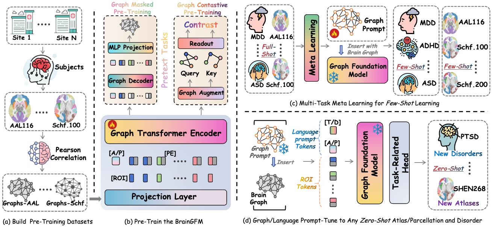

# BrainGFM (ICLR 2026)


**A Brain Graph Foundation Model: Pre-Training and Prompt-Tuning for Any Atlas and Disorder**

[](https://arxiv.org/abs/2506.02044)
[](#license)
[](#environment-setup)


---

## Overview

<!-- ✅ Replace the image filename(s) below with your actual files in ./assets -->


**BrainGFM** is a graph-based brain foundation model for connectome representation learning.
It unifies:
- **Graph Contrastive Learning (GCL)** for view-invariant representation learning
- **Graph Masked Autoencoder (GMAE)** for structure-aware reconstruction


---

## 🏗️ Project Architecture

```text
BrainGFM/
├── assets/                     # Figures used in README
├── BrainGFM_pretrain.py         # Core pretraining model (GCL/GMAE)
├── BrainGFM_Gprompt.py          # BrainGFM with graph prompt module
├── graph_prompt.py              # Prompt implementation utilities
├── disease_names.py             # Disease name / mapping
├── utils.py                     # Shared utils
├── main_pretrain.py             # Entry for pretraining
└── main_finetune.py             # Entry for finetuning / downstream eval

```

## Citation

```
@article{wei2025braingfm,
  title   = {A Brain Graph Foundation Model: Pre-Training and Prompt-Tuning for Any Atlas and Disorder},
  author  = {Wei, Xinxu and Zhao, Kanhao and Jiao, Yong and He, Lifang and Zhang, Yu},
  journal = {arXiv preprint arXiv:2506.02044},
  year    = {2025}
}
```
