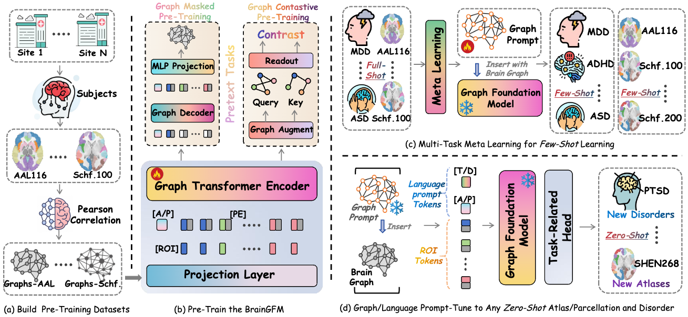

# BrainGFM (ICLR 2026)

<div align="center">

<h2>A Brain Graph Foundation Model: Pre-Training and Prompt-Tuning across Broad Atlases and Disorders</h2>

<p>
  Xinxu Wei</strong></a><sup>1</sup>, 
  Kanhao Zhao<sup>1</sup>, 
  Yong Jiao<sup>1</sup>, 
  Lifang He<sup>1</sup>, 
  Yu Zhang<sup>2</sup>
</p>

<p>
  <sup>1</sup>Lehigh University, Bethlehem PA, USA &nbsp;&nbsp;&nbsp;
  <sup>2</sup>Stanford University, Palo Alto CA, USA
</p>

<table>
  <tr>
    <td align="center" width="50%">
      
    </td>
    <td align="center" width="50%">
      
    </td>
  </tr>
</table>

[](https://openreview.net/forum?id=PeGHkAaRxs)
[](#license)
[](#environment-setup)

</div>

---

## Overview

<!-- ✅ Replace the image filename(s) below with your actual files in ./assets -->


**BrainGFM** is a graph-based brain foundation model for connectome representation learning.
It unifies:
- **Graph Contrastive Learning (GCL)** for view-invariant representation learning
- **Graph Masked Autoencoder (GMAE)** for structure-aware reconstruction


---

## 🏗️ Project Architecture

```text
BrainGFM/
├── assets/                      # Figures used in README
├── checkpoint/                  # Pretrained Checkpoint
├── BrainGFM_pretrain.py         # Core pretraining model (GCL/GMAE)
├── BrainGFM_Gprompt.py          # BrainGFM with graph prompt module
├── graph_prompt.py              # Prompt implementation utilities
├── disease_names.py             # Disease name / mapping
├── utils.py                     # Shared utils
├── main_pretrain.py             # Entry for pretraining
├── main_baseline.py             # Run baseline BrainGFM without pretrained model and finetuning
└── main_finetune.py             # Entry for finetuning / downstream eval

```


## 📦 Data Preparation

BrainGFM expects the input brain graph dataset to be stored in a **NumPy `.npy` file**.

Each sample corresponds to one subject and contains:

- **node_feat**: brain connectivity matrix (e.g., Pearson correlation matrix)
- **label**: classification label for the downstream task

The adjacency matrix used in the model is **computed directly from the connectivity matrix**.

---

## Dataset Format

The dataset should be stored as a **list of dictionaries** and saved as a single `.npy` file.

Example structure:

{
    "node_feat": numpy.ndarray,   # shape: [N, N]
    "label": int                  # class label
}

where

- **N** = number of brain regions (nodes)
- **node_feat** is typically the **functional connectivity matrix**

---

## Expected Dimensions

For a dataset with **B subjects**, the stacked tensor will have shape:

node_feat : [B, N, N]  
label     : [B]

where

- **B** = number of subjects
- **N** = number of brain regions in the atlas

Example atlases:

| Atlas | Number of Regions |
|------|------|
| Schaefer100 | 100 |
| AAL116 | 116 |
| Shen268 | 268 |

---

## Adjacency Matrix Construction

The graph adjacency matrix is derived from the connectivity matrix via thresholding.

Example used in this repository:

adj = (node_feat > 0.3).int()

Thus each brain graph consists of:

node features : node_feat  [N × N]  
adjacency     : adj        [N × N]

---

## Example: Creating the Dataset

import numpy as np

data_list = []

for i in range(num_subjects):

    sample = {
        "node_feat": conn_matrix[i],   # shape [N, N]
        "label": labels[i]
    }

    data_list.append(sample)

np.save("dataset.npy", data_list)

---

## Example: Loading the Dataset

data = np.load("dataset.npy", allow_pickle=True)

node_feat = np.stack([d["node_feat"] for d in data])
labels = np.array([d["label"] for d in data])

Resulting tensors:

node_feat : [B, N, N]  
labels    : [B]

---

## Notes

- BrainGFM supports **multiple brain atlases** and **multiple neurological disorders**.
- The only requirement is that each subject provides an **N × N connectivity matrix**.
- The adjacency matrix is automatically computed from the connectivity matrix during training.

···


## Installation

1. Clone the repository:

```bash
git clone https://github.com/weixinxu666/BrainGFM.git
cd BrainGFM

```


## 🚀 Execution Pipeline

All scripts in this repository are executable independently.  
However, we recommend following the pipeline below for standard usage and reproducibility.

---

### 1️⃣ Pretraining — Brain Foundation Model Learning

Train **BrainGFM** using Graph Contrastive Learning (GCL) and Graph Masked Autoencoder (GMAE):

```bash
python main_pretrain.py
```

This step:

- Performs self-supervised pretraining (GCL / GMAE)
- Learns atlas- and disorder-general representations
- Saves pretrained weights into the `checkpoint/` directory

---

### 2️⃣ Finetuning — Downstream Task Evaluation

After pretraining, run downstream disease classification:

```bash
python main_finetune.py
```

This step:

- Loads pretrained weights from `checkpoint/`
- Performs supervised finetuning
- Supports multi-atlas and multi-disorder settings
- Reports classification performance metrics

---

### 3️⃣ Baseline — Training Without Pretraining

To train BrainGFM **from scratch** (no pretraining):

```bash
python main_baseline.py
```

This is used for comparison with the pretrained model.

---

## 🔄 Recommended Order

```text
Step 1: main_pretrain.py
Step 2: main_finetune.py
Step 3: main_baseline.py (for comparison and ablation studies)
```

---

This pipeline ensures consistent experimental settings and fair evaluation across pretrained and non-pretrained models.


## Pretrained Checkpoint

We provide a pretrained model checkpoint to facilitate reproducibility and further research.

The checkpoint contains the trained model parameters used in our experiments and can be directly loaded for evaluation, fine-tuning, or downstream tasks.

**Download link:**  
[Checkpoint Model](https://drive.google.com/file/d/1uWlfDqT37kc6jKQ21xwnKvy8NSqbf2B2/view?usp=drive_link)


## Citation

```
@inproceedings{
wei2026a,
title={A Brain Graph Foundation Model: Pre-Training and Prompt-Tuning across Broad Atlases and Disorders},
author={Xinxu Wei and kanhao zhao and Yong Jiao and Lifang He and Yu Zhang},
booktitle={The Fourteenth International Conference on Learning Representations},
year={2026},
url={https://openreview.net/forum?id=PeGHkAaRxs}
}
```


## Contact

For questions or collaborations, please contact:  
[xiw523@lehigh.edu](mailto:xiw523@lehigh.edu)
